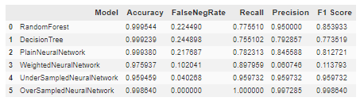

# Credit-Card-fraud-detection-system-using-Machine-Learning
Detect Fraudulent Credit Card transactions using different Machine Learning models and compare performances

In this notebook, I explore various Machine Learning models to detect fraudulent use of Credit cards. I compare each model performance and results. The best performance is achieved using SMOTE technique.

Please note that this approach can be transferred to other detection analysis in alternatrive domains. The feature extraction process remains similar and can be replicated on many other detection issues.

# Problem Statement

In this project we want to identify fraudulent transactions with Credit Cards.
Our objective is to build a Fraud detection system using Machine learning techniques.
In the past, such systems were rule-based. Machine learning offers powerful new ways.

The project uses a dataset of 300,000 fully anonymized transactions. Each transation is labelled either fraudulent or not fraudulent.
Note that prevalence of fraudulent transactions is very low in the dataset. Less than 0.1% of the card transactions are fraudulent. This means that a system predicting each transaction to be normal can reach an accuracy of over 99.9% despite not detecting any fraudulent transaction. This will necessitate adjustment techniques.

# Techniques used in the project
The project compares the results of different techniques :
- Machine learning techniques:
  - Random Forest
  - Decision Trees
- Deep Learning techniques:
  - Neural network using fully connected layers.

Performance of the neural network is compared for different optimization approaches:
- plain binary cross-entropy loss minimization
- minimization using weights to compensate for the class imbalance
- Under-sampling of the non-fraudulent class to match the fraudulent class
- Over-sampling of the fraudulent class to match the non-fraudulent one by implementing SMOTE technique. The SMOTE method allows to generate a new vector using 2 existing datapoints. For additional details on this approach, you can read this detailed post [SMOTE for Imbalanced Classification with Python](https://machinelearningmastery.com/smote-oversampling-for-imbalanced-classification/)

Note about the difference between Random Forest and Decision tree models:
- A Random Forest is essentially a collection of Decision Trees. A decision tree is built on an entire dataset, using all the features/variables, whereas a random forest randomly selects observations (rows) and specific features/variables to build multiple decision trees from and then averages the results. After a large number of trees are built using this method, each tree "votes" or chooses the class, and the class receiving the most votes by a simple majority is the "winner" or predicted class. 
- When using a decision tree model on a given training dataset the accuracy improves with more and more splits. You can easily overfit the data and it is recommended to use cross validation technique. The advantages of a simple decision tree model:  easy to interpret, you know what variable and what value of that variable is used to split the data and predict outcome.
- A random forest is like a black box. You can specify the number of trees you want in your forest(n_estimators) and you can specify the max_num of features to be used in each tree. But you cannot control the randomness: which feature used for which tree, which data point is part of which tree... Accuracy keeps increasing as you increase the number of trees, but becomes constant at certain point. Random forest reduces the variance part of error rather than bias part. Unlike decision tree, it won't create highly biased model overfitting the data. By choosing features randomly during the training process, random forest does not depend highly on any specific set of features. This is a special characteristic of random forest over bagging trees. It generalizes better and on unseen validation dataset, Random forest always wins over Decision Tree in terms of accuracy.
- You can read more about these two models [here](https://www.analyticsvidhya.com/blog/2020/05/decision-tree-vs-random-forest-algorithm/).

# Results

The best results are achieved by over-sampling the under-represented class using SMOTE (synthetic minority oversampling technique).
With this approach, the model is able to detect 100% of all fraudulent transactions in the unseen test set. This fully satisfies the primary objective to detect the vast majority of abnormal transactions. Please note that the technique and model used are simple to implement simple, easy to use and can be updated in real-time.

In addition, the number of false positive remains acceptable. This means a lot less verification work (on legitimate transactions) for the fraud departement compare dto some other approaches which failed on this aspect. Key results are shown below:

Confusion matrix achieved using SMOTE over-sampling and a simple dense neural network:

Comparison of key performance indicators between the tested approaches:

